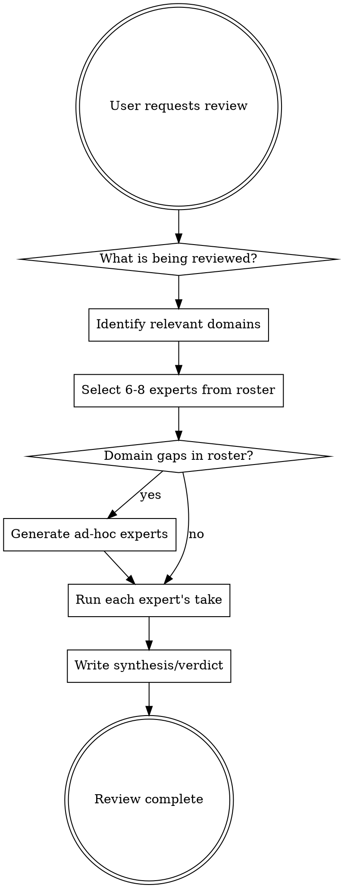

# Expert Review

Review work from a dynamically-selected panel of real, named experts. Each expert stays true to their known philosophy — direct, not diplomatic.

## Process



### Step 1: Identify domains

Analyse what's being reviewed. Map it to domains:

| Category | Example domains |
|----------|----------------|
| **Code** | performance, correctness, API design, error handling, async, testing, observability |
| **Architecture** | modularity, coupling, scale, data flow, security boundaries |
| **Product** | user experience, market fit, simplicity, accessibility |
| **Business** | unit economics, legal/compliance, risk, go-to-market |
| **Process** | team workflow, deployment, incident response |

### Step 2: Select experts

Read the roster at [roster.md](roster.md). If `roster.md` does not exist, copy [default-roster.md](default-roster.md) to `roster.md` first — this gives the user a starter panel they can customise.

Select 6-8 experts whose domains match the review target. Prioritise experts whose known philosophy directly applies.

**Selection rules:**
- At least one expert should challenge the fundamental approach ("is this the right thing to build?")
- At least one should focus on long-term maintenance cost
- Never pick experts just to fill slots — each must have something specific to say about THIS work
- If the roster has fewer than 3 relevant experts for a domain, proceed to Step 3

### Step 3: Fill domain gaps (if needed)

When the roster lacks coverage for a relevant domain, generate ad-hoc expert personas:
- Use a **real, named person** known for that domain (not a generic "Security Expert")
- State their name, known focus, and what they'd flag
- Format identically to roster entries

After the review, suggest the user add useful ad-hoc experts to their roster:
> "Consider adding [Name] to your expert roster — edit `~/.claude/skills/expert-review/roster.md` or ask me to add them"

**Never invent generic categories** ("Security Expert", "Performance Reviewer", "Senior Engineer"). Every expert must be a real, identifiable person with known public work. If you can't name a real person for a domain, skip that domain — a gap is better than a fabricated voice.

### Step 4: Run expert takes

For each selected expert, write their review:

**Format per expert:**
```
**[Name]** ([affiliation/known-for])
Focus: [their lens for THIS review]

[2-5 direct observations. Stay in character — use their known priorities and communication style. Be specific: reference exact lines, names, patterns. No hedging, no diplomatic padding.]
```

**Rules:**
- Each expert MUST say something different. If two experts would make the same point, cut one.
- Experts should disagree with each other where their philosophies conflict. Surface the tension.
- Quote or reference specific parts of what's being reviewed — no vague gestures.
- If an expert would genuinely have nothing useful to say about this particular work, don't include them. 5 sharp experts beats 8 with padding.
- NEVER pad the panel. If only 4 experts have something real to say, use 4. The range 6-8 is a ceiling, not a quota.

### Step 5: Synthesis

After all expert takes, write a verdict:

```
## Verdict

**Consensus:** [What most experts agree on]

**Key tensions:** [Where experts disagree and why — name the experts on each side]

**Top actions:** [Ranked list of concrete changes, ordered by impact]

**Open questions:** [Things the review surfaced but couldn't resolve]
```

The synthesis must surface disagreements, not paper over them. If matklad says "this is fine, it's boring and correct" and Dan Luu says "where's the benchmark?", that tension is the valuable signal.

## Managing the roster

Users can customise their expert panel:

- **Add experts**: `/expert-review add` — guided flow (see below)
- **Edit directly**: Edit [roster.md](roster.md) by hand
- **Remove an expert**: Delete their entry from roster.md
- **Project-specific experts**: Add an `## Expert Review Panel` section to the project's CLAUDE.md — these supplement (not replace) the global roster

### `/expert-review add` flow

When the user invokes `/expert-review add` (with or without a name), walk them through building their panel:

1. **Show current roster** — list current experts by category with a one-line summary each
2. **Identify gaps** — based on the user's typical work (check project CLAUDE.md, recent conversation context), suggest 2-3 domains that are underrepresented. Examples: "You have no security expert", "No one covers database design", "Your frontend coverage is thin"
3. **Ask what they want to add** — let the user name someone, describe a domain they want covered, or pick from your suggestions
4. **For each expert to add:**
   - If you recognise the person: pre-fill their focus, flags, and "Ask:" question. Show the draft and ask the user to confirm or tweak
   - If you don't recognise them: ask the user three questions:
     - What's their focus/domain?
     - What do they typically flag or criticise?
     - What's the core question they'd ask about any piece of work?
   - Ask which roster category to place them in (suggest one, let user override)
5. **Write to roster.md** — append the new entry in the existing format, under the chosen category
6. **Confirm** — show what was added and the updated category listing

The user can add multiple experts in one session — loop back to step 3 until they're done.
